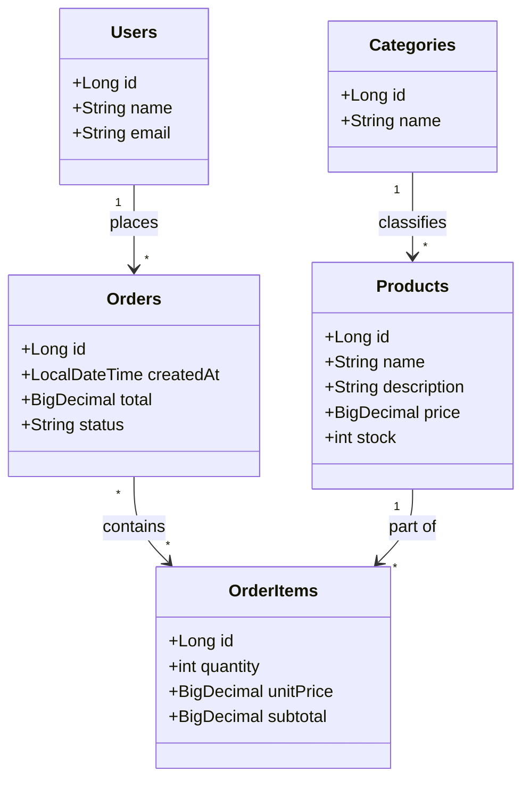

```mermaid
classDiagram
    class Users {
        +Long id
        +String name
        +String email
    }

    class Categories {
        +Long id
        +String name
    }

    class Products {
        +Long id
        +String name
        +String description
        +BigDecimal price
        +int stock
    }

    class Orders {
        +Long id
        +LocalDateTime createdAt
        +BigDecimal total
        +String status
    }

    class OrderItems {
        +Long id
        +int quantity
        +BigDecimal unitPrice
        +BigDecimal subtotal
    }

    Users "1" --> "*" Orders : places
    Orders "*" --> "*" OrderItems : contains
    Products "1" --> "*" OrderItems : part of
    Categories "1" --> "*" Products : classifies
```
