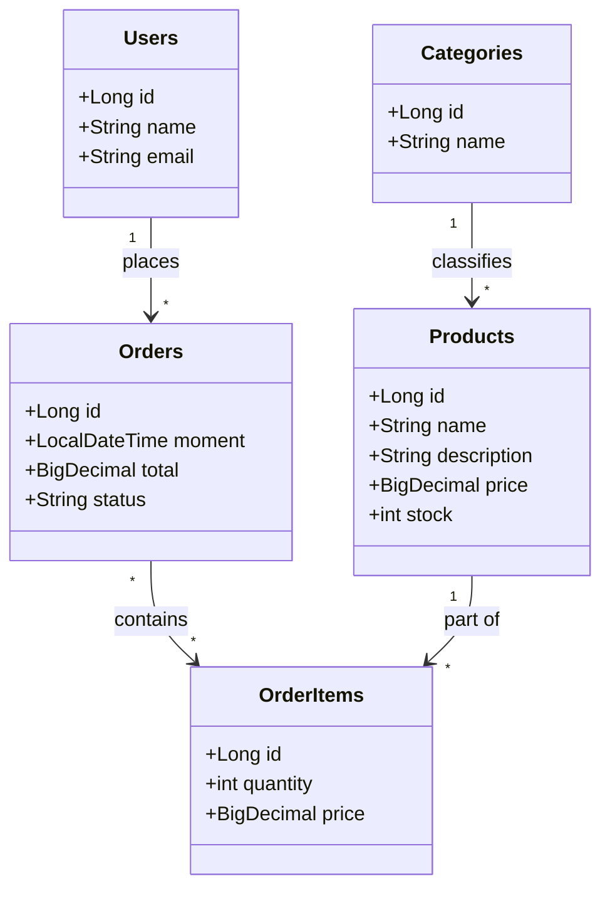

# Order System API
API REST para um sistema de gerenciamento de pedidos, desenvolvido como parte de um estudo sobre desenvolvimento backend com Java e Spring Boot.

## Visão Geral
Este projeto consiste em uma API para gerenciar as entidades principais de um sistema de e-commerce simples: Usuários, Pedidos, Produtos e Categorias. A aplicação foi construída seguindo as melhores práticas de desenvolvimento de APIs REST e uma arquitetura em camadas para garantir a separação de responsabilidades e a manutenibilidade do código.


## Funcionalidades
- Usuários: Gerenciamento completo (CRUD - Criar, Ler, Atualizar, Deletar) de usuários.
- Pedidos: Listagem de pedidos e busca por ID.
- Produtos: Listagem de produtos e busca por ID.
- Categorias: Listagem de categorias e busca por ID.

##  Tecnologias Utilizadas
A API foi construída com as seguintes tecnologias e ferramentas:

#### Backend:
- Java 17
- Spring Boot
- Spring Data JPA
- Hibernate
#### Banco de Dados:
- H2 Database (Para ambiente de desenvolvimento/teste)
- Postgresql (Para ambiente de produção)
#### Build e Gerenciamento de Dependências:
- Gradle

## Como Executar o Projeto (Ambiente de Desenvolvimento)
Para executar o projeto localmente com o banco de dados em memória (H2), siga os passos abaixo.

Pré-requisitos
- Java JDK 17 ou superior instalado.
- Gradle instalado (ou use o Gradle Wrapper incluído).
- Um cliente de API, como Postman ou Insomnia.

## Passos para Execução
Clone o repositório:

```
git clone https://github.com/Phc01/Order-System-API.git
```
Navegue até o diretório do projeto:

```
cd Order-System-API
```
Execute a aplicação com o Gradle Wrapper:

No Linux ou macOS:
```
./gradlew bootRun
```
No Windows:
```
gradlew.bat bootRun
```
Pronto! A API estará em execução no endereço ```http://localhost:8080```. O perfil de teste do Spring Boot irá popular o banco de dados H2 com dados iniciais.