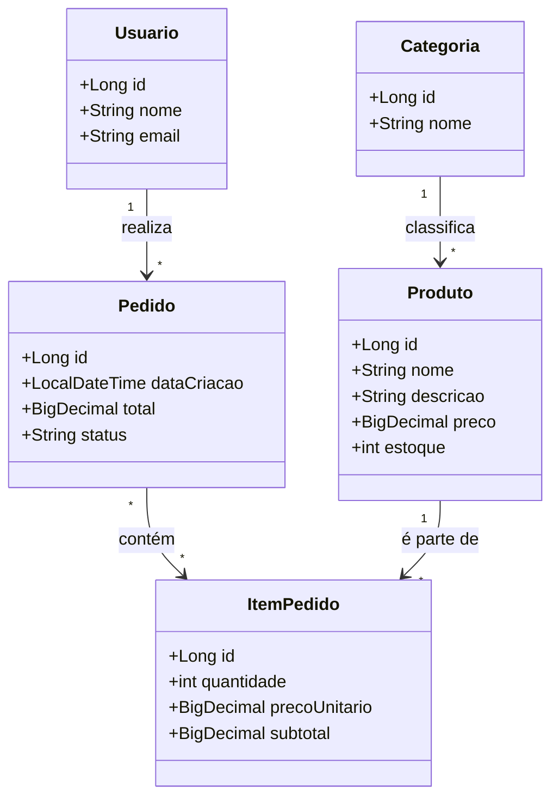

# Order System APi

## Diagrama de Classes

```mermaid
classDiagram
    class Usuario {
        +Long id
        +String nome
        +String email
    }

    class Categoria {
        +Long id
        +String nome
    }

    class Produto {
        +Long id
        +String nome
        +String descricao
        +BigDecimal preco
        +int estoque
    }

    class Pedido {
        +Long id
        +LocalDateTime dataCriacao
        +BigDecimal total
        +String status
    }

    class ItemPedido {
        +Long id
        +int quantidade
        +BigDecimal precoUnitario
        +BigDecimal subtotal
    }

    Usuario "1" --> "*" Pedido : realiza
    Pedido "*" --> "*" ItemPedido : contém
    Produto "1" --> "*" ItemPedido : é parte de
    Categoria "1" --> "*" Produto : classifica
```
